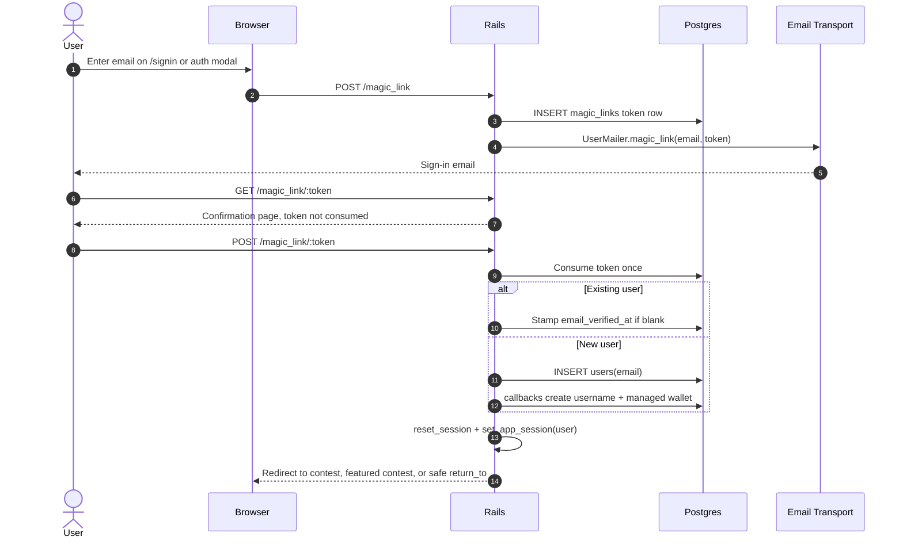
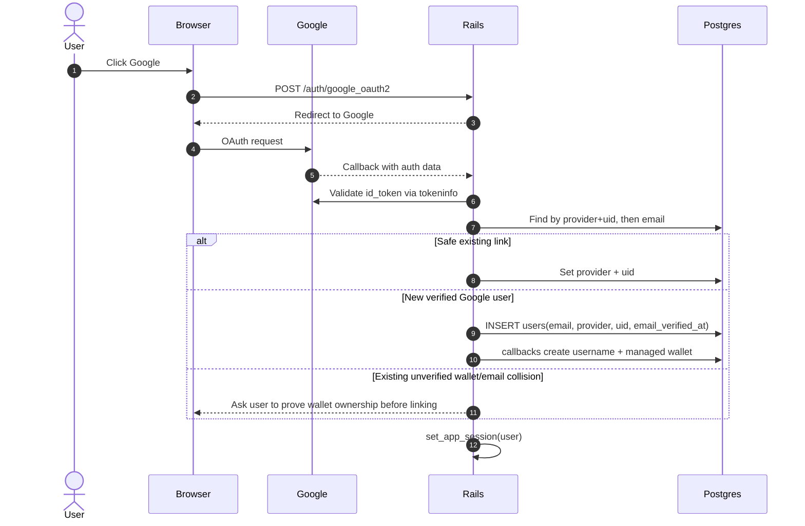
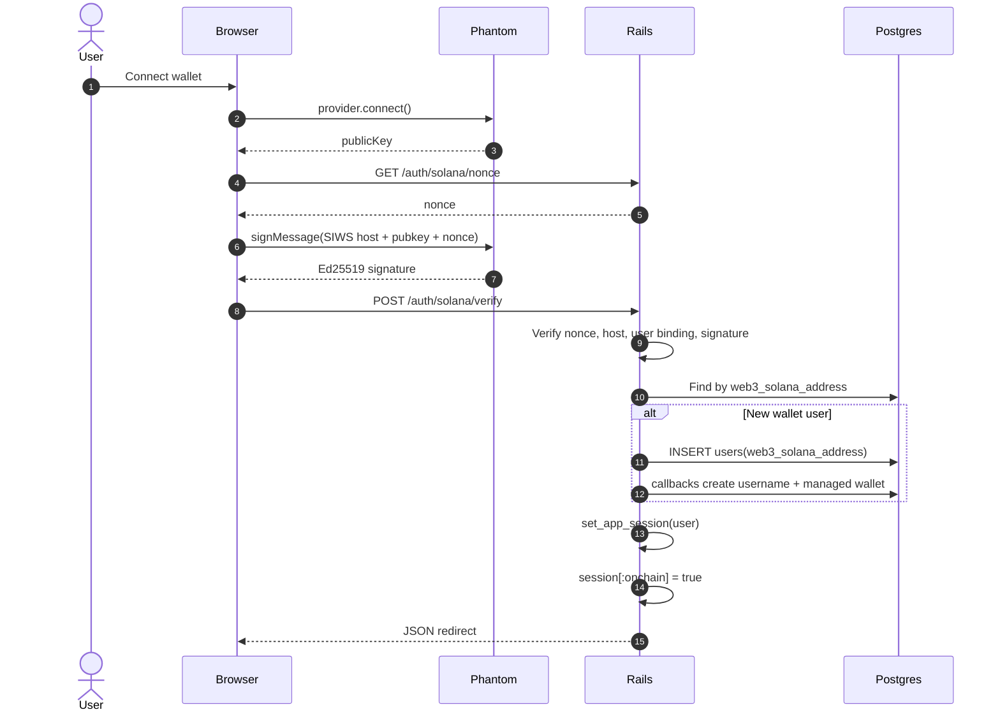

# Sign-Up Flows

Visual companion to [AUTH.md](AUTH.md). Turf Monster has three public
create-or-login doors and one shared account spine.

## TL;DR

- **Email is magic-link only.** There is no password sign-up, password login,
  password reset, or `User#authenticate`.
- **Google sign-in trusts Google only after server-side token validation.**
  `GoogleOauthValidator` re-checks the ID token before `User.from_omniauth`
  links or creates anything.
- **Wallet sign-in proves key ownership without Solana RPC.** SIWS signature
  verification is local Ed25519 math; chain writes happen later.
- **Every non-admin account gets a server-managed wallet.** Phantom users also
  keep their own `web3_solana_address`; managed wallet funds still live in the
  user's own token accounts, not a pooled DB balance.

## Overview

```
                  FRONTEND                 THIRD PARTY              BACKEND (Rails)
                  -------------------      --------------------     -----------------------------

  EMAIL    web2   form POST /magic_link -> email inbox click     -> MagicLinksController#consume
                  GET token interstitial    scanner-safe GET         creates or logs in

  GOOGLE   oauth  POST /auth/google...  -> Google OAuth +       -> OmniauthCallbacksController#create
                                             tokeninfo recheck

  PHANTOM  web3   connect + sign SIWS   -> Phantom signs        -> SolanaSessionsController#verify
                                             message only

                          ALL THREE CONVERGE ON THE SAME SPINE
                                          |
                                          v
   User callbacks                                    set_app_session
     - ensure_username                                 - session[:turf_user_id]
     - set_initial_session_token                       - session[:session_token]
     - generate_managed_wallet!                        - clears stale web3 state
     - enqueue_onchain_account_setup
```

The Solana chain is not contacted during sign-up. New accounts get an encrypted
managed-wallet keypair in Postgres, then `CreateOnchainUserAccountJob` creates
the on-chain username PDA asynchronously.

## The Shared Spine

Once any controller has a `User` row, account initialization is the same:

1. `before_validation :ensure_username, on: :create` fills `users.username`.
2. `before_create :set_initial_session_token` writes `users.session_token`.
3. `after_create :generate_managed_wallet!` creates a server-managed Ed25519
   wallet for non-admin users and encrypts the secret with
   `MANAGED_WALLET_ENCRYPTION_KEY`.
4. `after_commit :enqueue_onchain_account_setup, on: :create` schedules
   `CreateOnchainUserAccountJob`.
5. `set_app_session(user)` writes the Rails cookie session and clears stale
   web3/on-chain privilege unless the wallet controller explicitly re-grants it.

There is no `sessions`, `wallets`, or `identities` table. Auth identity and
wallet identity are columns on `users`.

## Flow 1 - Email Magic Link

**Entry:** `POST /magic_link` -> email -> `GET /magic_link/:token` ->
`POST /magic_link/:token`

**Key files:** `MagicLinksController`, `MagicLink`, `UserMailer#magic_link`,
`app/views/magic_links/confirm.html.erb`



The GET is intentionally inert so Gmail, SafeLinks, Mimecast, and preview bots
cannot burn the single-use token. Only the CSRF-protected POST consumes it.

## Flow 2 - Google OAuth

**Entry:** `POST /auth/google_oauth2` or popup `GET /auth/google_popup` ->
`GET /auth/google_oauth2/callback`

**Key files:** `OmniauthCallbacksController`, `GoogleOauthValidator`,
`User.from_omniauth`, `config/initializers/omniauth.rb`



Brand-new Google signups get `email_verified_at` immediately because Google
proved the address and the server re-validated the token.

## Flow 3 - Phantom / Wallet

**Entry:** `GET /auth/solana/nonce` -> wallet signature ->
`POST /auth/solana/verify`

**Key files:** `SolanaSessionsController`,
`app/controllers/concerns/solana/session_auth.rb`, `solana-studio`
`Solana::AuthVerifier`, `wallet_provider.js`, `phantom_deeplink.js`



`session[:onchain] = true` means this browser session has fresh wallet proof and
can proceed to on-chain signing flows. It is cleared by non-wallet login paths.

## Fallback `POST /signup`

`Studio.routes(self)` still draws `POST /signup`, and Turf keeps a local
`RegistrationsController#create` override for compatibility and tests. The live
human GET for `/signup` redirects to `/signin`. Do not build new password UI on
this endpoint.

When reached, the fallback accepts the configured registration params
(`[:email, :reference]`), enforces age attestation if enabled, creates the user,
and redirects to the entry-token upsell. It does not set a password.

## Shared Supporting Behavior

- **Age attestation:** flag-gated across all new-account paths.
- **Reference attribution:** a first-touch 30-day `cookies[:reference]` is
  copied to new users by magic-link, Google, and wallet signups.
- **Post-signup landing:** in-contest auth tries to return to the contest and
  restore picks; generic new-user flows usually land on the featured contest or
  the entry-token upsell depending on the controller path.
- **Email verification:** magic-link and Google signups prove email ownership.
  Users who add or change email later use the separate verification and
  out-of-band confirmation flows.

## Data Touched By Signup

- `users`: email and/or Google identity and/or wallet identity, username,
  managed wallet columns, `session_token`, optional `reference`.
- `magic_links`: one row per email magic-link request, consumed once.
- `session`: `turf_user_id`, `session_token`, and only for fresh wallet auth,
  `onchain`.
- On-chain: no synchronous signup writes; `CreateOnchainUserAccountJob` later
  ensures the username PDA.

## Key Files

| Area | File | Role |
|---|---|---|
| Shared | `app/models/user.rb` | Auth columns, username/wallet callbacks, OAuth and wallet finders |
| Shared | `app/controllers/application_controller.rb` | `set_app_session`, session-token verification, wallet context |
| Shared | `app/models/session_context.rb` | Guest/web2/web3 mode for `$store.session` |
| Email | `app/controllers/magic_links_controller.rb` | Request, confirm, consume magic links |
| Email | `app/models/magic_link.rb` | DB-backed one-time token lifecycle |
| Email | `app/mailers/user_mailer.rb` | Magic-link email and account emails |
| Google | `app/controllers/omniauth_callbacks_controller.rb` | OAuth callback, popup close, collision handling |
| Google | `app/services/google_oauth_validator.rb` | Server-side Google ID-token validation |
| Wallet | `app/controllers/solana_sessions_controller.rb` | Nonce, signature verify, wallet login |
| Wallet | `app/controllers/concerns/solana/session_auth.rb` | Host-bound SIWS verification wrapper |
| Wallet | `solana-studio` gem | Ed25519 verifier and transaction/RPC primitives |
