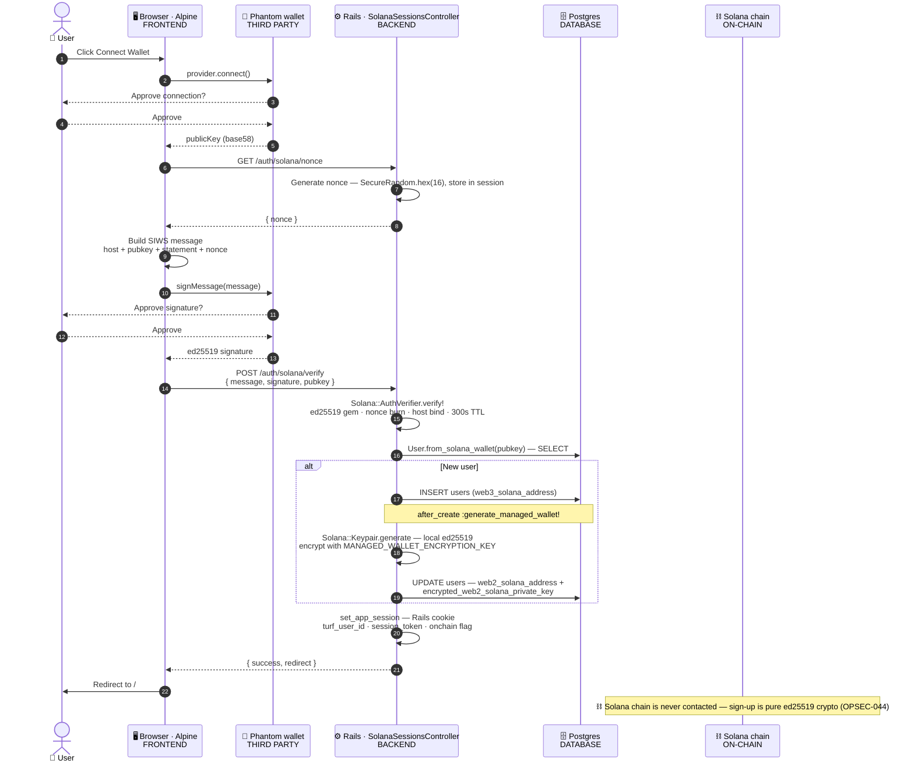
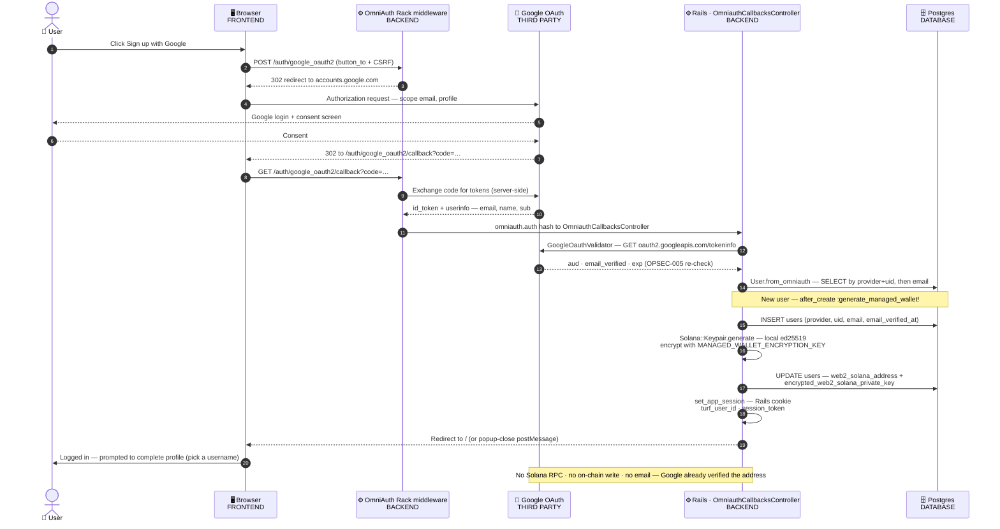
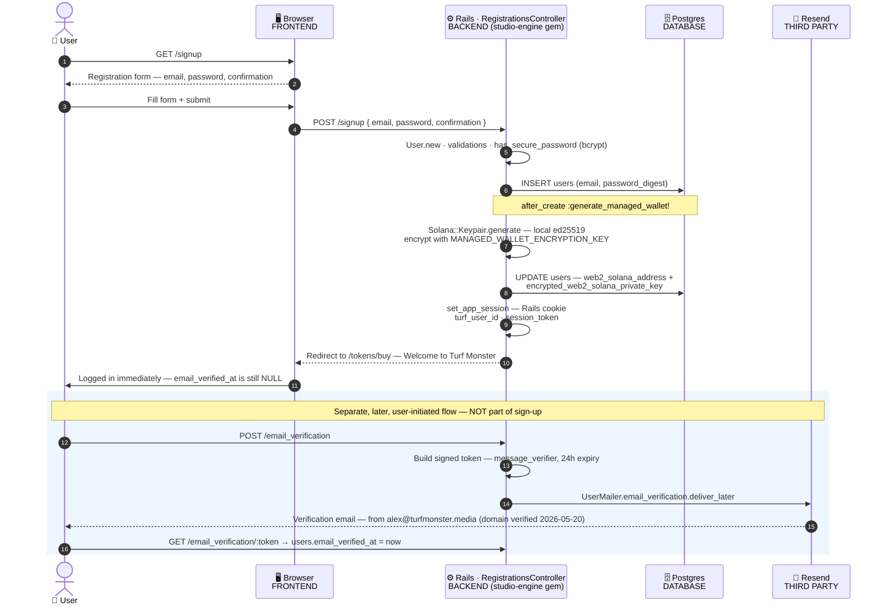

# Sign-Up Flows

Visual companion to [`AUTH.md`](AUTH.md) — how Turf Monster's three sign-up paths span
**frontend**, **backend**, **third parties**, and the **Solana chain**.

_Generated 2026-05-20. For auth security internals (nonce replay, host binding, account merge) see [`AUTH.md`](AUTH.md)._

## TL;DR

- **Three independent entry controllers, one shared spine.** `SolanaSessionsController`,
  `OmniauthCallbacksController`, and `RegistrationsController` share no code — what unifies them
  is the `User` model: `after_create :generate_managed_wallet!` plus the `set_app_session` helper.
- **The Solana chain is never contacted during sign-up** — even on the Phantom/web3 path.
  Signature verification is pure `ed25519`-gem math on the server; `OPSEC-044` deliberately
  removed the one on-chain call.
- **Every user gets a server-held managed wallet** — including Phantom users, who end up with
  *both* their own wallet and a managed one. Admins are the only exception.

## Overview

```
                  FRONTEND                 THIRD PARTY              BACKEND (Rails)
                  ───────────────────      ────────────────────     ─────────────────────────────

  PHANTOM  web3   Alpine: connect       →  Phantom signs the    →   SolanaSessionsController#verify
                  + sign SIWS message      message (ed25519)

  GOOGLE   oauth  button_to POST        →  Google OAuth +       →   OmniAuth middleware  →
                  /auth/google_oauth2      tokeninfo recheck         OmniauthCallbacksController#create

  MANUAL   email  form POST /signup     →  (no third party)     →   RegistrationsController#create
                  email only (no pwd)

                          ALL THREE CONVERGE ON THE SAME SPINE
                                          │
                                          ▼
   User#after_create :generate_managed_wallet!         set_app_session
     - Solana::Keypair.generate (local ed25519)          - session[:turf_user_id]
     - encrypt with MANAGED_WALLET_ENCRYPTION_KEY         - session[:session_token]
     - UPDATE users -> web2_solana_address                => logged in (Rails cookie)
                                          │
                                          ▼
   ON-CHAIN (Solana)   not touched by any sign-up. The managed wallet exists only as
                       encrypted bytes in Postgres until a later funding / contest entry.
```

## The shared spine

Once any of the three controllers has a `User` row, the rest is identical:

1. **`before_validation :ensure_username, on: :create`** (`user.rb:20`) — auto-fills the DB `username` column via `Studio::UsernameGenerator.generate` if blank. Guarantees no user ever has a blank username.
2. **`before_create :set_initial_session_token`** — writes `users.session_token`
   (`SecureRandom.hex(32)`), the OPSEC-045 cookie-binding token.
3. **`after_create :generate_managed_wallet!`** (`app/models/user.rb:237`) — unless the user is
   an admin, generates a custodial Solana keypair via `Solana::Keypair.generate` (local ed25519,
   **no RPC**), encrypts the secret key with a key derived from `MANAGED_WALLET_ENCRYPTION_KEY`,
   and writes `web2_solana_address` + `encrypted_web2_solana_private_key`.
4. **`after_commit :enqueue_onchain_account_setup, on: :create`** (`user.rb:27`) — enqueues `CreateOnchainUserAccountJob`, which calls `Solana::Vault#ensure_user_account(wallet, username:)` to create the on-chain `UserAccount` PDA with the username eagerly. **Async** — users are logged in before the PDA is finalized; reads of `user.username` always work because the DB column is set in step 1. See `docs/AUTH.md` § On-Chain Usernames.
5. **`set_app_session(user)`** — writes the Rails cookie session (`session[:turf_user_id]`,
   `session[:session_token]`, SSO-awareness fields). No DB session row, no JWT.

There is no `Session`, `Wallet`, or `Identity` table — everything hangs off `users`.

**Post-signup redirect (all 3 flows)**: lands on `tokens_buy_path` (the entry-tokens upsell modal), not the root. Wired in `registrations_controller.rb:17`, `omniauth_callbacks_controller.rb:104`, and `solana_sessions_controller.rb:52`.

**Age attestation (all 3 flows — flag-gated, parked OFF)**: when `ENABLE_AGE_ATTESTATION=true` (`AppFlags.age_attestation?`), a legal-age checkbox (`shared/_age_attestation`) gates every signup surface, each controller rejects new signups without it (`age_attestation_required? && !age_attestation_given?`), and `age_attested_at` is stamped on the new row. **Currently unset in prod = OFF** (operator call 2026-06-10, re-enabled after the first contest): the checkbox doesn't render, all gates pass, and `age_attested_at` is deliberately NOT stamped. See `docs/AUTH.md` § Legal-Age Attestation.

**Reference attribution (all 3 flows)**: a 30-day `cookies[:reference]` set by `LandingPagesController#show` (`app/controllers/landing_pages_controller.rb:18`) or `ApplicationController#capture_reference` (`application_controller.rb:51-56`) is persisted onto `users.reference` at signup. Phantom captures it inline at user-build (`solana_sessions_controller.rb:37-42`); Google updates the column post-create and deletes the cookie (`omniauth_callbacks_controller.rb:95-98`); Manual carries it through a hidden form field (`registrations/new.html.erb:17`). First-touch wins — the cookie is only set when blank.

## Flow 1 — Phantom (web3 wallet)

**Entry:** `GET /auth/solana/nonce` → `POST /auth/solana/verify`
**Key files:** `app/views/layouts/application.html.erb` (inline Alpine), `app/javascript/wallet_provider.js`,
`phantom_deeplink.js` (mobile), `solana_sessions_controller.rb`, `concerns/solana/session_auth.rb`,
`solana-studio` gem `auth_verifier.rb`



> **Mobile:** when the Phantom extension is absent, `phantom_deeplink.js` redirects to
> `phantom.app/ul/v1/signIn`; the encrypted response is decrypted client-side in
> `solana_sessions/phantom_callback.html.erb`, which then POSTs the same
> `{ message, signature, pubkey }` to `/auth/solana/verify`.

## Flow 2 — Google (OAuth)

**Entry:** `POST /auth/google_oauth2` (OmniAuth middleware) → `GET /auth/google_oauth2/callback`
**Key files:** `config/initializers/omniauth.rb`, `omniauth_callbacks_controller.rb`,
`app/services/google_oauth_validator.rb`, `registrations/new.html.erb` + `sessions/new.html.erb` (buttons)



> A second surface — the in-contest "Turf Totals" auth modal — opens `/auth/google_popup` in a
> 500×650 popup; on success it `postMessage`s the opener window and closes. Same backend path.

## Flow 3 — Manual (email + password)

**Entry:** `GET /signup` now 301-redirects to the unified `/signin` page (`sessions#new`); the magic-link request is the primary email surface. `POST /signup` (account-from-email) stays as a no-live-UI fallback.
**Key files:** `registrations/new.html.erb` (view override) + `app/controllers/registrations_controller.rb` (**local override** of the engine controller — age-attestation gate when `ENABLE_AGE_ATTESTATION` is on, `tokens_buy_path` redirect), `email_verifications_controller.rb` + `user_mailer.rb` (separate verify flow)

> ⚠️ The diagram below predates the password removal (2026-06-01, PR #18): there are no password
> fields anymore — `POST /signup` creates the account from email alone (`Studio.registration_params`),
> and magic link is the only email *login*. The wallet/session spine in the diagram is still accurate.



> Email verification is **not** part of sign-up — manual users are logged in immediately with
> `email_verified_at` NULL. The separate `/email_verification` flow sends a 24h signed token via
> Resend (`turfmonster.media`, a verified sending domain). Google users skip it (born verified).

## What to notice

1. **Three doors, one room.** No shared sign-up controller — the three controllers are entirely
   separate. A 4th sign-up method would inherit the managed wallet + session for free, because
   both live on the `User` model, not in controller code.
2. **On-chain sits sign-up out entirely.** Even the Phantom/web3 flow never calls a Solana RPC
   node. `OPSEC-044` deliberately removed the one on-chain call (`EnsureAtaJob`) to stop sybil
   wallets draining rent SOL. A new wallet is just encrypted bytes in Postgres until its first
   funding / contest entry.
3. **Everyone gets a custodial wallet — even Phantom users.** A Phantom sign-up ends with *both*
   `web3_solana_address` (the user's own wallet) and `web2_solana_address` (server-managed, key
   encrypted at rest). Only admins are exempt — `generate_managed_wallet!` has `return if admin?`.
4. **Email is off the critical path.** Manual sign-up logs you in immediately; `email_verified_at`
   stays NULL until the user opts into the separate `/email_verification` flow. Google users are
   born verified (re-checked server-side, OPSEC-005). No sign-up flow blocks on email delivery.
5. **One model, one cookie.** No `Session`, `Wallet`, `Identity`, or `ManagedWallet` table — all
   of it is columns on `users`, and the session is a plain Rails cookie (`turf_user_id` +
   `session_token`, the latter force-logging-out on mismatch — OPSEC-045).

## Key files

| Area | File | Role |
|---|---|---|
| **Shared** | `app/models/user.rb` | `ensure_username` (L20, L312), `enqueue_onchain_account_setup` (L27, L317), `generate_managed_wallet!` (L237), `set_initial_session_token` (L22, L217), `from_solana_wallet`, `from_omniauth` |
| | `app/models/session_context.rb` | PORO — canonical guest/web2/web3 mode for `$store.session` (2026-05-20) |
| | `app/jobs/create_onchain_user_account_job.rb` | Async on-chain `UserAccount` PDA + username creation at signup (2026-05-22) |
| | `app/services/solana/keypair.rb` | Managed-wallet keypair encryption (`MANAGED_WALLET_ENCRYPTION_KEY`) |
| | `app/services/solana/vault.rb` | `ensure_user_account`, `create_user_account`, `set_username`, `build_set_username` |
| | `app/controllers/application_controller.rb` | `set_app_session`, `verify_session_token`, `wallet_context` (builds `SessionContext`) |
| | `config/initializers/studio.rb` | `session_key = :turf_user_id`, `registration_params` |
| | `db/schema.rb` | `users` — `web2_/web3_solana_address`, `encrypted_web2_solana_private_key`, `session_token`, `username` |
| **Phantom** | `app/views/layouts/application.html.erb` | Inline Alpine `solanaWalletConnect()` — connect, sign, POST |
| | `app/javascript/wallet_provider.js` · `phantom_deeplink.js` | Phantom detection; mobile deep-link |
| | `app/controllers/solana_sessions_controller.rb` | `#nonce`, `#verify`, `#phantom_callback` |
| | `app/controllers/concerns/solana/session_auth.rb` | Nonce replay protection (delete-before-verify) |
| | `solana-studio` gem `lib/solana/auth_verifier.rb` | ed25519 signature verification |
| **Google** | `config/initializers/omniauth.rb` | `omniauth-google-oauth2` provider config |
| | `app/controllers/omniauth_callbacks_controller.rb` | `#create` (find-or-create), `#popup`, `#failure` |
| | `app/services/google_oauth_validator.rb` | Server-side `tokeninfo` re-validation (OPSEC-005) |
| **Manual** | `app/views/registrations/new.html.erb` | Registration form (view override) |
| | `studio-engine` gem `registrations_controller.rb` | `#create` |
| | `app/controllers/email_verifications_controller.rb` · `app/mailers/user_mailer.rb` | Separate email-verification flow |
